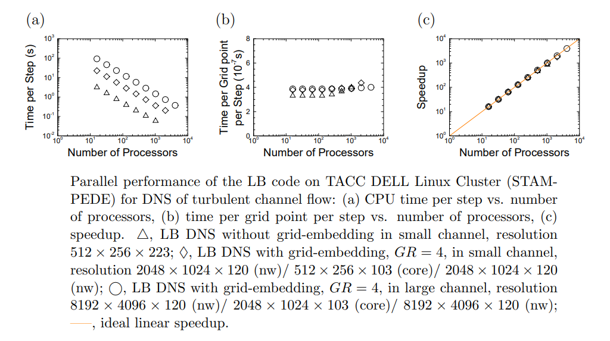
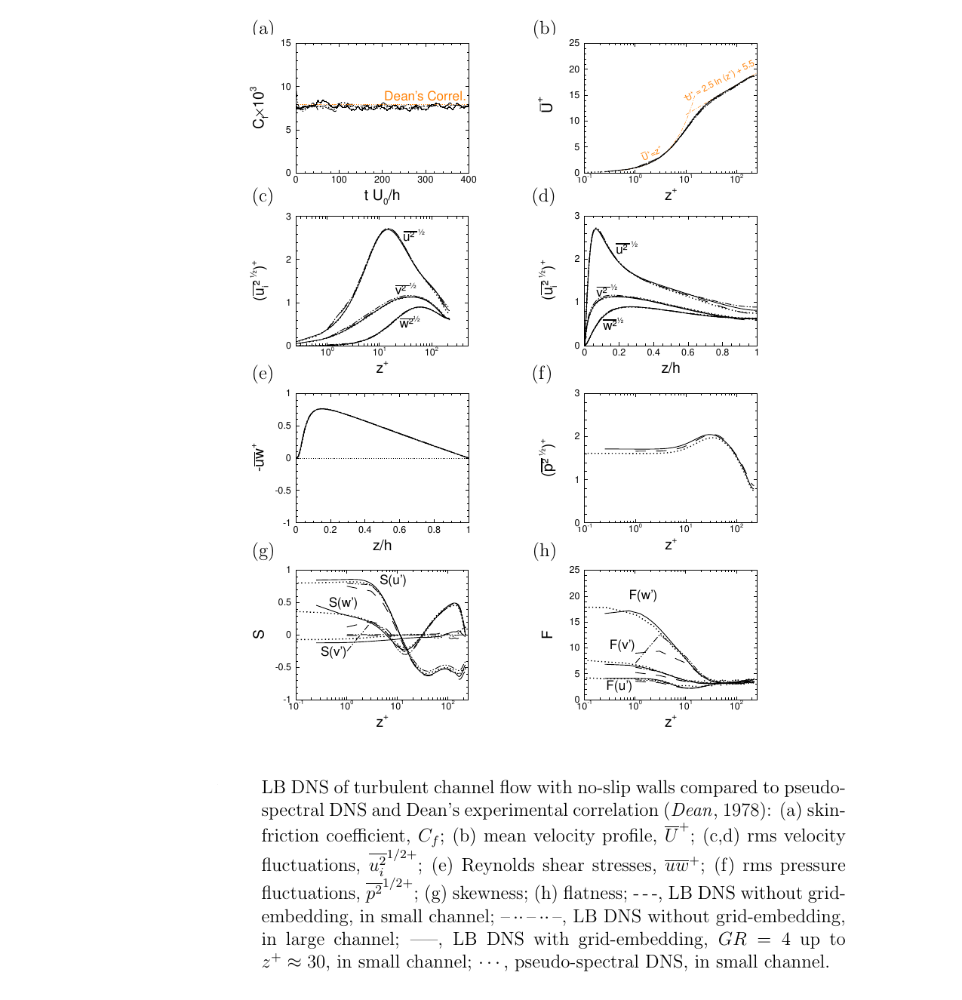

# Direct Numerical Simulation of Turbulent Channel Flows

This repository contains the source codes for direct numerical simulation (DNS) of turbulent channel flow with various patterns of slip/no-slip boundary conditions on the walls. 

A 2-Dimensional domain decomposition is used for the parallel implementation of the solver, in which the solution domain is divided into subdomains in the streamwise and spanwise directions, as seen in figure below. 


The solver maintained almost ideal parallel efficiency and speedup on TACC's stampede in scaling studies, as seen in figure below.
.

## Requirements

- MPI 
- C compiler 

## Installation

1. Clone the repository and CD to the repo
2. Modify the grid sizes and problem specifications in the `definitions.h` file located in the `src` directory. 

3. Compile the codes by running the following command:
```
    make
```

## Usage

To perform the computations:
```
mpirun -np N ./run-dns -p
```

Replace `N` with the desired number of MPI ranks. 

### Input files
The program expects the following input file:

  * "lbf.time" (e.g. vel.0001) : the initial value of the distribution functions, where time denotes the begining time of the simulation. The input file is structured with array indices running from (0..Nx-1, 0..Ny-1, 0..Nz-1, 0..19), where the indices go by first z index, then y index, then x, then i (lattice velocity vectors). The files are expected to be row major, as is the case for the C language.

#### Output files
The program outputs the following files, which are to be used for postprocessing using the supplemental codes in the parent repository:

  * "vel.time" (e.g. vel.0001) : velocity file containing the instantaneous field of the flow velocity vectors at time T, with array indices running from (0..Nx-1, 0..Ny-1, 0..Nz-1, 0..2), where 0..2 denotes the 3 velocity vector directions in x, y and z. 

 * "den.time" (e.g. den.0001) : density file containing the instantaneous density (pressure) field at time T, with array indices running from (0..Nx-1, 0..Ny-1, 0..Nz-1). 

  * "p-grad.txt" time history of the evolution of the pressure gradient applied to the flow (either constant or time dependent) 

  * "flowrate.txt" time history of the flow rate in the channel (either constant or time dependent)

## Results

The computations use single relaxation time BGK lattice Bolztmann method, hence the overall accuracy of the results is second order. Results obtained from this solver have been published in the journal of fluid mechanics, [here](https://doi.org/10.1017/jfm.2015.266) and [here](https://doi.org/10.1017/jfm.2017.865). 


The results in base turbulent channel flow are in full agreement with the published DNS databases of Jimenez et al. and Moser et al. as seen in figure below.
 

## Author

Amirreza Rastegari [@arstgr](https://github.com/arstgr)

## To Cite

If you use this code in your research, please cite the following work:

  * Rastegari, S.A., 2017. Computational studies of turbulent skin-friction drag reduction with super-hydrophobic surfaces and riblets ([Doctoral dissertation](https://deepblue.lib.umich.edu/handle/2027.42/136986)), the University of Michigan.

  * Rastegari, A. and Akhavan, R., 2015. On the mechanism of turbulent drag reduction with super-hydrophobic surfaces, JFM, 773 (R4). 

  * Rastegari, A. and Akhavan, R., 2018. The Common Mechanism of Turbulent Skin-Friction Drag Reduction with Super-Hydrophobic Micro-Grooves and Riblets, JFM, 838 (68-104). 


## Version History

* 0.1
    * Initial Release

## License

This project is licensed under the GNU Affero general public License. Refer to the [LICENSE](LICENSE) file for more information.
